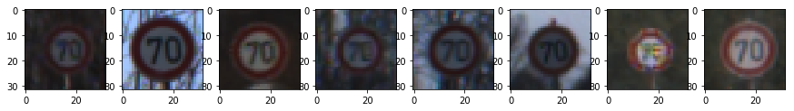
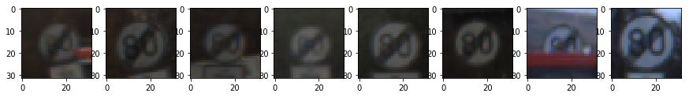
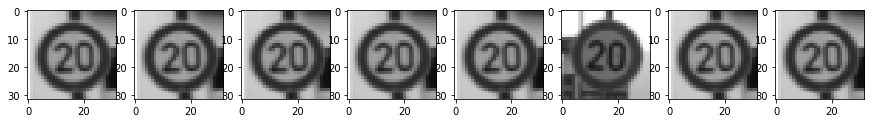
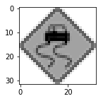
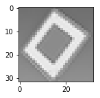
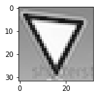

**Traffic Sign Recognition**
============================

 

*For the complete implementation and notebook:*

<https://github.com/aurangzaib/CarND-Traffic-Sign-Classifier-Project>

 

**Build a Traffic Sign Recognition Project:**

The goals / steps of this project are the following:

-   Load the German Traffic Signs pre-labelled dataset

-   Explore, summarize and visualize the data set

-   Design, train and test a model architecture with high accuracy

-   Use the model to make predictions on new images from the internet

-   Analyze the softmax probabilities of the new images

 

### **Data Set Summary & Exploration:**

First we will explore together the dataset of traffic signs. We will see what is
a shape of an image, how many training, validation and testing examples are
available in the dataset.

As we will see, the dataset doesn't have a uniform distribution of the samples
for each class.

| **Property**       | **Summary** |
|--------------------|-------------|
| Image shape        | 32x32x3     |
| Training samples   | 34799       |
| Validation samples | 12630       |
| Testing samples    | 4410        |
| Unique classes     | 43          |

 

#### **2. Exploratory visualization of the dataset:**

Now we will visualize the dataset, what are the features available and how the
labels are distributed in the dataset:

 

~~~~~~~~~~~~~~~~~~~~~~~~~~~~~~~~~~~~~~~~~~~~~~~~~~~~~~~~~~~~~~~~~~~~~~~~~~~~~~~~
Class 1 -- Speed limit (20km/h) -- 180 samples
~~~~~~~~~~~~~~~~~~~~~~~~~~~~~~~~~~~~~~~~~~~~~~~~~~~~~~~~~~~~~~~~~~~~~~~~~~~~~~~~

 

~~~~~~~~~~~~~~~~~~~~~~~~~~~~~~~~~~~~~~~~~~~~~~~~~~~~~~~~~~~~~~~~~~~~~~~~~~~~~~~~
Class 2 -- Speed limit (30km/h) -- 1980 samples
~~~~~~~~~~~~~~~~~~~~~~~~~~~~~~~~~~~~~~~~~~~~~~~~~~~~~~~~~~~~~~~~~~~~~~~~~~~~~~~~

 

~~~~~~~~~~~~~~~~~~~~~~~~~~~~~~~~~~~~~~~~~~~~~~~~~~~~~~~~~~~~~~~~~~~~~~~~~~~~~~~~
Class 3 -- Speed limit (50km/h) -- 2010 samples
~~~~~~~~~~~~~~~~~~~~~~~~~~~~~~~~~~~~~~~~~~~~~~~~~~~~~~~~~~~~~~~~~~~~~~~~~~~~~~~~

 

~~~~~~~~~~~~~~~~~~~~~~~~~~~~~~~~~~~~~~~~~~~~~~~~~~~~~~~~~~~~~~~~~~~~~~~~~~~~~~~~
Class 4 -- Speed limit (60km/h) -- 1260 samples
~~~~~~~~~~~~~~~~~~~~~~~~~~~~~~~~~~~~~~~~~~~~~~~~~~~~~~~~~~~~~~~~~~~~~~~~~~~~~~~~

 

~~~~~~~~~~~~~~~~~~~~~~~~~~~~~~~~~~~~~~~~~~~~~~~~~~~~~~~~~~~~~~~~~~~~~~~~~~~~~~~~
Class 5 -- Speed limit (70km/h) -- 1770 samples
~~~~~~~~~~~~~~~~~~~~~~~~~~~~~~~~~~~~~~~~~~~~~~~~~~~~~~~~~~~~~~~~~~~~~~~~~~~~~~~~

 

~~~~~~~~~~~~~~~~~~~~~~~~~~~~~~~~~~~~~~~~~~~~~~~~~~~~~~~~~~~~~~~~~~~~~~~~~~~~~~~~
Class 6 -- Speed limit (80km/h) -- 1650 samples
~~~~~~~~~~~~~~~~~~~~~~~~~~~~~~~~~~~~~~~~~~~~~~~~~~~~~~~~~~~~~~~~~~~~~~~~~~~~~~~~

 

~~~~~~~~~~~~~~~~~~~~~~~~~~~~~~~~~~~~~~~~~~~~~~~~~~~~~~~~~~~~~~~~~~~~~~~~~~~~~~~~
Class 7 -- End of speed limit (80km/h) -- 360 samples
~~~~~~~~~~~~~~~~~~~~~~~~~~~~~~~~~~~~~~~~~~~~~~~~~~~~~~~~~~~~~~~~~~~~~~~~~~~~~~~~

 

~~~~~~~~~~~~~~~~~~~~~~~~~~~~~~~~~~~~~~~~~~~~~~~~~~~~~~~~~~~~~~~~~~~~~~~~~~~~~~~~
Class 8 -- Speed limit (100km/h) -- 1290 samples
~~~~~~~~~~~~~~~~~~~~~~~~~~~~~~~~~~~~~~~~~~~~~~~~~~~~~~~~~~~~~~~~~~~~~~~~~~~~~~~~

 

~~~~~~~~~~~~~~~~~~~~~~~~~~~~~~~~~~~~~~~~~~~~~~~~~~~~~~~~~~~~~~~~~~~~~~~~~~~~~~~~
Class 9 -- Speed limit (120km/h) -- 1260 samples
~~~~~~~~~~~~~~~~~~~~~~~~~~~~~~~~~~~~~~~~~~~~~~~~~~~~~~~~~~~~~~~~~~~~~~~~~~~~~~~~

 

~~~~~~~~~~~~~~~~~~~~~~~~~~~~~~~~~~~~~~~~~~~~~~~~~~~~~~~~~~~~~~~~~~~~~~~~~~~~~~~~
Class 10 -- No passing -- 1320 samples
~~~~~~~~~~~~~~~~~~~~~~~~~~~~~~~~~~~~~~~~~~~~~~~~~~~~~~~~~~~~~~~~~~~~~~~~~~~~~~~~

 

 

#### **Labels distribution in Train Dataset:**

 

#### **Labels distribution in Augmented Dataset:**

As we discussed, the dataset contains very few samples for some the classes.
Obviously, we need to fix it.

We will see later how we can fix this issue by augmenting the given dataset but
for now let's enjoy the histogram after the data augmentation.

 

#### **Labels distribution in Test Dataset:**

 

### **Pre-process the Data Set:**

Pre-processing is an important step before training neural network. It consists
of:

-   Grayscale the images.

-   Normalize the dataset using Feature Scaling.

 

[Yann LeCun Paper](http://yann.lecun.com/exdb/publis/pdf/sermanet-ijcnn-11.pdf)
describes that the color channel info doesn't play any useful part in
classification, so we apply grayscaling on the images to have uniform values in
all 3 channels. The images are transformed to 3 channel grayscale using OpenCV.

The train, validation and test datasets are normalized using Feature Rescaling.

| **Property**          | **Value** |
|-----------------------|-----------|
| Before Normalization: |           |
| Pixel Value           | 0 to 255  |
| After Normalization:  |           |
| Pixel Value           | \-1 to +1 |
| Mean                  | \~0       |

 

 

### **Image Transformations and Rotations:**

 

The idea for Label preserving data augmentation came from the [AlexNet for
ImageNet Classification](https://goo.gl/i8MHfX)

As we saw earlier, the dataset doesn’t contain the uniform distribution of the
samples for each class. We can fix it by generating new images by performing
transformation using translation, rotation, changing brightness etc. This is
called Data Augmentation.

With augmentation, we gain another advantage that now our training set is larger
than before and also more varied so it also helps in reducing the overfit during
the training process.

I primarily used OpenCV for image transformations.

#### Visualize how the transformation is performed.

 

 

### **Design and Test a Model Architecture**

 

Now, I implemented the multi-layer Convolutional Neural Network architecture. 

The starting point was the LeNet Architecture which consists of Convolution
Layers followed by Fully Connected layers:

Then I adjusted the architecture by following Sermanet & LeCun Publication on
Traffic Sign Recognition.   
[<http://yann.lecun.org/exdb/publis/psgz/sermanet-ijcnn-11.ps.gz>] 

 

 

Then I tweaked the architecture further as follows:

-   Using 3 Convolution layers.

-   Using Dropouts after the Fully Connected layers. Dropout was proposed by
    [Geoffrey Hinton et al](https://goo.gl/Y7QH0b). It is a technique to reduce
    overfit by randomly dropping the few units so that the network can never
    rely on any given activation. Dropout helps network to learn redundant
    representation of everything to make sure some of the information retain.

*Note: When Dropout technique is used, the dropped out neurons do not contribute
in forward and backward pass.*

My architecture is slightly modified from the above mentioned reference
architecture and is as follows: 

| **Layer**   | **Description** | **Filter Weight** | **Filter Bias** | **Stride** | **Padding** | **Dropout** | **Dimension**        | **Parameter** |
|-------------|-----------------|-------------------|-----------------|------------|-------------|-------------|----------------------|---------------|
| **Layer 1** | Convolutional   | 5x5x6             | 6               | 2x2        | Valid       | 1.0         | Input: 32x32x3       | 456           |
|             |                 |                   |                 |            |             |             | ReLU: 28x28x6        |               |
|             |                 |                   |                 |            |             |             | Max Pooling: 14x14x6 |               |
| **Layer 2** | Convolutional   | 5x5x16            | 16              | 2x2        | Valid       | 1.0         | Input: 14x14x6       | 2416          |
|             |                 |                   |                 |            |             |             | ReLU: 10x10x16       |               |
|             |                 |                   |                 |            |             |             | Max Pooling: 5x5x16  |               |
| **Layer 3** | Convolutional   | 5x5x400           | 400             | 2x2        | Valid       | 1.0         | Input: 5x5x16        | 160400        |
|             |                 |                   |                 |            |             |             | ReLU: 1x1x400        |               |
| **Flatten** |                 |                   |                 |            |             |             | 400                  |               |
| **Layer 4** | Fully Connected | 400x120           | 120             |            |             | 0.6         | Input: 400           | 48120         |
|             |                 |                   |                 |            |             |             | ReLU: 120            |               |
| **Layer 5** | Fully Connected | 120x84            | 84              |            |             | 0.5         | Input: 120           | 14520         |
|             |                 |                   |                 |            |             |             | ReLU: 84             |               |
| **Layer 6** | Output          | 84x43             | 43              |            |             |             | Input: 84            | 7140          |
|             |                 |                   |                 |            |             |             | Logits: 84           |               |

 

The hyper parameters are as follows:

| **Parameter**      | **Value**    |
|--------------------|--------------|
| Mean               | 0            |
| Standard Deviation | 0.1          |
| Epochs             | 25           |
| Batch Size         | 128          |
| Learn Rate         | 0.001        |
| Dropouts           | Layer 1: 1.0 |
|                    | Layer 2: 1.0 |
|                    | Layer 3: 0.6 |
|                    | Layer 4: 0.5 |
|                    | Layer 5: 0.5 |
| Test Dropouts      | 1.0          |

 

Now we will train the classifier.

 

I used Adam Optimizer to optimize Weights and Biases using Back Propogation
instead of using Stochastic Gradient Descent. Following is the implementation of
the LeNet Architecture. For implementation details of each layer, please have a
look to the [Github
repo.](https://github.com/aurangzaib/CarND-Traffic-Sign-Classifier-Project)

When training a network on not-so-powerful computers, it is important to apply
Mini-batching so that the network can be trained with small chunks of the
training data at a time without overloading the memory of the machine.

Now, for actual training of the network, we need to create a session of
TensorFlow and optimize the parameters. My results for the Validation sets are:

 

| **Epochs** | **Accuracy (%)** | **Epochs** | **Accuracy (%)** |
|------------|------------------|------------|------------------|
| 1st        | 71.020           | 2nd        | 80.839           |
| 3rd        | 86.576           | 4th        | 86.469           |
| 5th        | 89.138           | 6th        | 90.680           |
| 7th        | 91.270           | 8th        | 92.449           |
| 9th        | 92.426           | 10th       | 93.424           |
| 11th       | 93.832           | 12th       | 93.379           |
| 13th       | 93.469           | 14th       | 94.490           |
| 15th       | 93.628           | 16th       | 94.376           |
| 17th       | 93.129           | 18th       | 94.535           |
| 19th       | 94.376           | 20         | 95.215           |
| 21st       | 94.921           | 22nd       | 94.671           |
| 23rd       | 94.649           | 24th       | 94.581           |
| 25th       | 94.172           |            |                  |

 

Now comes the part where we test the accuracy of the network on the hidden test
data.
 

**The network is able to achieve 95.306% accuracy on the test data.**

| Test Accuracy | 95.306% |
|---------------|---------|

### **Test a Model on New Images:**

To give myself more insight into how my model is working, I downloaded several
images from the internet of traffic signs and tested the accuracy of the
pre-trained network.

 

**Discussion​ on New Test Data:**

 

**Image 1:** It is Left Turn sign and the network classifies correctly. \ 

 

**Image 2:** It is a Bicycle Crossing sign but it is slightly modified from the sign the
network was trained on. The network confuses it with the Right-of-way sign.

 

**Image 3:** It is Ahead Only sign and the network classifies correctly.

 

**Image 4:** It is a Traffic Signal sign. The network confuses it with the Pedastrian sign.

 

**Image 5:** It is a Slippery Road sign. The network confuses it with the Stop sign. The
reason might be that in train data the Slippery Road sign has car inclined in it
while the test image has car horizontal it.

 

**Image 6, 7, 8:** These are Priority road, Turn Right Ahead and Yeild signs respectively. The
network classifies correctly.

 

**Predictions on New Test Data:**

| **Predictions**                       | **Confidence (%)**       |
|---------------------------------------|--------------------------|
| Dangerous curve to the left           | 100.000                  |
| Slippery road                         | 0.000                    |
| Right-of-way at the next intersection | 0.000                    |
| Double curve                          | 0.000                    |
| Road work                             | 0.000                    |
| **Ground Truth**                      | **Dangerous curve left** |

| **Predictions**                       | **Confidence (%)**   |
|---------------------------------------|----------------------|
| Road narrows on the right             | 42.401               |
| Pedestrians                           | 37.532               |
| General caution                       | 19.522               |
| Traffic signals                       | 0.370                |
| Right-of-way at the next intersection | 0.150                |
| **Ground Truth**                      | **Bicycle crossing** |

| **Predictions**      | **Confidence (%)** |
|----------------------|--------------------|
| Ahead only           | 100.000            |
| No passing           | 0.000              |
| Bicycles crossing    | 0.000              |
| Turn left ahead      | 0.000              |
| Speed limit (60km/h) | 0.000              |
| **Ground Truth**     | **Ahead Only**     |

| **Predictions**           | **Confidence (%)**  |
|---------------------------|---------------------|
| Road narrows on the right | 98.333%             |
| Pedestrians               | 0.889               |
| Road work                 | 0.563               |
| Children crossing         | 0.071               |
| General caution           | 0.052               |
| **Ground Truth**          | **Traffic Signals** |

| **Prediction**       | **Confidence (%)** |
|----------------------|--------------------|
| No entry             | 99.996             |
| Stop                 | 0.004              |
| Turn right ahead     | 0.000              |
| Roundabout mandatory | 0.000              |
| Speed limit (70km/h) | 0.000              |
| **Ground Truth**     | **Slippery road**  |

| **Predictions**                       | **Confidence (%)** |
|---------------------------------------|--------------------|
| Priority road                         | 100.000            |
| Roundabout mandatory                  | 0.000              |
| Right-of-way at the next intersection | 0.000              |
| Yield                                 | 0.000              |
| No passing                            | 0.000              |
| **Ground Truth**                      | **Priority road**  |

| **Predictions**      | **Confidence (%)**       |
|----------------------|--------------------------|
| Turn right ahead     | 99.983                   |
| Stop                 | 0.017                    |
| Keep left            | 0.000                    |
| Speed limit (30km/h) | 0.000                    |
| No entry             | 0.000                    |
| **Ground Truth**     | **Go straight or right** |

| **Predictions**                                    | **Confidence (%)**       |
|----------------------------------------------------|--------------------------|
| Roundabout mandatory                               | 42.161                   |
| End of no passing by vehicles over 3.5 metric tons | 38.446                   |
| Right-of-way at the next intersection              | 13.663                   |
| Priority road                                      | 2.242                    |
| Keep right                                         | 1.334                    |
| **Ground Truth**                                   | **Roundabout mandatory** |

 
=

*For the complete implementation and notebook:*

<https://github.com/aurangzaib/CarND-Traffic-Sign-Classifier-Project>
