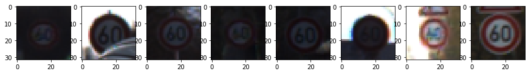
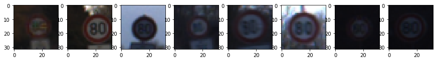
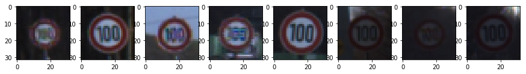
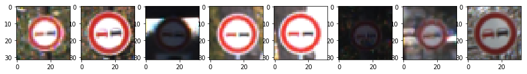
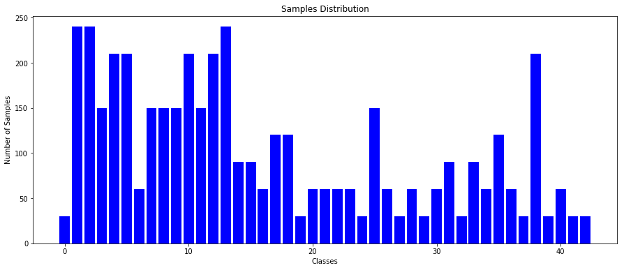

**Traffic Sign Recognition**
============================

 

**Build a Traffic Sign Recognition Project**

The goals / steps of this project are the following: \* Load the German Traffic
Signs pre-labelled dataset \* Explore, summarize and visualize the data set \*
Design, train and test a model architecture with high accuracy \* Use the model
to make predictions on new images from the internet \* Analyze the softmax
probabilities of the new images

 

### Data Set Summary & Exploration:

First we will explore together the dataset of traffic signs. We will see what is
a shape of an image, how many training, validation and testing examples are
available in the dataset.

As we will see, the dataset doesn't have a uniform distribution of the samples
for each class.

 

~~~~~~~~~~~~~~~~~~~~~~~~~~~~~~~~~~~~~~~~~~~~~~~~~~~~~~~~~~~~~~~~~~~~~~~~~ python
def get_data_summary(feature, label):
    import numpy as np
    # What's the shape of an traffic sign image?
    image_shape = feature[0].shape
    # How many unique classes/labels there are in the dataset.
    unique_classes, n_samples = np.unique(label,
                                          return_index=False,
                                          return_inverse=False,
                                          return_counts=True)
    n_classes = len(unique_classes)
    n_samples = n_samples.tolist()
    print("Image data shape =", image_shape)
    return image_shape[0], image_shape[2], n_classes, n_samples


def train_test_examples(x_train, x_validation, x_test):
    # Number of training examples
    n_train = len(x_train)
    # Number of validation examples
    n_validation = len(x_validation)
    # Number of testing examples.
    n_test = len(x_test)
    print("Number of training examples =", n_train)
    print("Number of validation examples =", n_validation)
    print("Number of testing examples =", n_test)
~~~~~~~~~~~~~~~~~~~~~~~~~~~~~~~~~~~~~~~~~~~~~~~~~~~~~~~~~~~~~~~~~~~~~~~~~~~~~~~~

-   Image shape = (32, 32, 3)

-   Number of training examples = 34799

-   Number of validation examples = 12630

-   Number of testing examples = 4410

-   Number of unique classes = 43

 

#### 2. Include an exploratory visualization of the dataset:

Now we will visualize the dataset, what are the features available and how the
labels are distributed in the dataset.

~~~~~~~~~~~~~~~~~~~~~~~~~~~~~~~~~~~~~~~~~~~~~~~~~~~~~~~~~~~~~~~~~~~~~~~~~ python
def get_classes_samples(index, labels):
    return [i for i, _x_ in enumerate(labels) if _x_ == index]


def loopover_data(index, x, y, high_range, steps):
    import matplotlib.pyplot as plt
    % matplotlib inline
    images = get_classes_samples(index, y)
    _images_ = images[:high_range:steps] if len(images) > 100 else images
    imgaes_in_row = int(high_range/steps)
    fig, axes = plt.subplots(1, imgaes_in_row, figsize=(15, 15))
    for _index, image_index in enumerate(_images_):
        image = x[image_index].squeeze()
        axes[_index].imshow(image)
    plt.show()


def visualize_data(x, y, n_classes, n_samples, high_range=160, steps=20, show_desc=True, single_class=False):
    from pandas.io.parsers import read_csv
    label_signs = read_csv('signnames.csv').values[:, 1]  # fetch only sign names
    if single_class:
        loopover_data(n_classes, x, y, high_range, steps)
    else:
        for index in range(n_classes):
            if show_desc:
                print("Class {} -- {} -- {} samples".format(index + 1, label_signs[index], n_samples[index]))
            loopover_data(index, x, y, high_range, steps)
~~~~~~~~~~~~~~~~~~~~~~~~~~~~~~~~~~~~~~~~~~~~~~~~~~~~~~~~~~~~~~~~~~~~~~~~~~~~~~~~

~~~~~~~~~~~~~~~~~~~~~~~~~~~~~~~~~~~~~~~~~~~~~~~~~~~~~~~~~~~~~~~~~~~~~~~~~~~~~~~~
Class 1 -- Speed limit (20km/h) -- 180 samples
~~~~~~~~~~~~~~~~~~~~~~~~~~~~~~~~~~~~~~~~~~~~~~~~~~~~~~~~~~~~~~~~~~~~~~~~~~~~~~~~


~~~~~~~~~~~~~~~~~~~~~~~~~~~~~~~~~~~~~~~~~~~~~~~~~~~~~~~~~~~~~~~~~~~~~~~~~~~~~~~~
Class 2 -- Speed limit (30km/h) -- 1980 samples
~~~~~~~~~~~~~~~~~~~~~~~~~~~~~~~~~~~~~~~~~~~~~~~~~~~~~~~~~~~~~~~~~~~~~~~~~~~~~~~~


~~~~~~~~~~~~~~~~~~~~~~~~~~~~~~~~~~~~~~~~~~~~~~~~~~~~~~~~~~~~~~~~~~~~~~~~~~~~~~~~
Class 3 -- Speed limit (50km/h) -- 2010 samples
~~~~~~~~~~~~~~~~~~~~~~~~~~~~~~~~~~~~~~~~~~~~~~~~~~~~~~~~~~~~~~~~~~~~~~~~~~~~~~~~


~~~~~~~~~~~~~~~~~~~~~~~~~~~~~~~~~~~~~~~~~~~~~~~~~~~~~~~~~~~~~~~~~~~~~~~~~~~~~~~~
Class 4 -- Speed limit (60km/h) -- 1260 samples
~~~~~~~~~~~~~~~~~~~~~~~~~~~~~~~~~~~~~~~~~~~~~~~~~~~~~~~~~~~~~~~~~~~~~~~~~~~~~~~~



~~~~~~~~~~~~~~~~~~~~~~~~~~~~~~~~~~~~~~~~~~~~~~~~~~~~~~~~~~~~~~~~~~~~~~~~~~~~~~~~
Class 5 -- Speed limit (70km/h) -- 1770 samples
~~~~~~~~~~~~~~~~~~~~~~~~~~~~~~~~~~~~~~~~~~~~~~~~~~~~~~~~~~~~~~~~~~~~~~~~~~~~~~~~


~~~~~~~~~~~~~~~~~~~~~~~~~~~~~~~~~~~~~~~~~~~~~~~~~~~~~~~~~~~~~~~~~~~~~~~~~~~~~~~~
Class 6 -- Speed limit (80km/h) -- 1650 samples
~~~~~~~~~~~~~~~~~~~~~~~~~~~~~~~~~~~~~~~~~~~~~~~~~~~~~~~~~~~~~~~~~~~~~~~~~~~~~~~~



~~~~~~~~~~~~~~~~~~~~~~~~~~~~~~~~~~~~~~~~~~~~~~~~~~~~~~~~~~~~~~~~~~~~~~~~~~~~~~~~
Class 7 -- End of speed limit (80km/h) -- 360 samples
~~~~~~~~~~~~~~~~~~~~~~~~~~~~~~~~~~~~~~~~~~~~~~~~~~~~~~~~~~~~~~~~~~~~~~~~~~~~~~~~


~~~~~~~~~~~~~~~~~~~~~~~~~~~~~~~~~~~~~~~~~~~~~~~~~~~~~~~~~~~~~~~~~~~~~~~~~~~~~~~~
Class 8 -- Speed limit (100km/h) -- 1290 samples
~~~~~~~~~~~~~~~~~~~~~~~~~~~~~~~~~~~~~~~~~~~~~~~~~~~~~~~~~~~~~~~~~~~~~~~~~~~~~~~~



~~~~~~~~~~~~~~~~~~~~~~~~~~~~~~~~~~~~~~~~~~~~~~~~~~~~~~~~~~~~~~~~~~~~~~~~~~~~~~~~
Class 9 -- Speed limit (120km/h) -- 1260 samples
~~~~~~~~~~~~~~~~~~~~~~~~~~~~~~~~~~~~~~~~~~~~~~~~~~~~~~~~~~~~~~~~~~~~~~~~~~~~~~~~


~~~~~~~~~~~~~~~~~~~~~~~~~~~~~~~~~~~~~~~~~~~~~~~~~~~~~~~~~~~~~~~~~~~~~~~~~~~~~~~~
Class 10 -- No passing -- 1320 samples
~~~~~~~~~~~~~~~~~~~~~~~~~~~~~~~~~~~~~~~~~~~~~~~~~~~~~~~~~~~~~~~~~~~~~~~~~~~~~~~~



~~~~~~~~~~~~~~~~~~~~~~~~~~~~~~~~~~~~~~~~~~~~~~~~~~~~~~~~~~~~~~~~~~~~~~~~~ python
def histogram_data(x, n_samples, n_classes):
    import matplotlib.pyplot as plt
    width = 1 / 1.2
    fig = plt.figure(figsize=(15, 6))
    ax = fig.add_subplot(111)
    ax.set_title('Samples Distribution')
    ax.set_xlabel('Classes')
    ax.set_ylabel('Number of Samples')
    plt.bar(range(n_classes), n_samples, width, color="blue")
    plt.show()
~~~~~~~~~~~~~~~~~~~~~~~~~~~~~~~~~~~~~~~~~~~~~~~~~~~~~~~~~~~~~~~~~~~~~~~~~~~~~~~~

#### Labels distribution in Train Dataset:


#### Labels distribution in Augmented Dataset:

As we discussed, the dataset contains very few samples for some the classes.
Obviously, we need to fix it.

We will see later how we can fix this issue by augmenting the given dataset but
for now let's enjoy the histogram after the data augmentation.


#### Labels distribution in Test Dataset:



### Pre-process the Data Set:

 

Preprocessing is an important step before training neural network. It consists
of:

Grayscale the images.

Normalize the dataset using Feature Scaling.

[Yann LeCun Paper](http://yann.lecun.com/exdb/publis/pdf/sermanet-ijcnn-11.pdf )
describes that the color channel info doesn't play any useful part in
classification, so we apply grayscaling on the images to have uniform values in
all 3 channels. The images are transformed to 3 channel grayscale using OpenCV.

 

The train, validation and test datasets are normalized using Feature Rescaling.
With normalization we have the pixel values ranging from 0 to 1 instead of 0 to
255.

 

~~~~~~~~~~~~~~~~~~~~~~~~~~~~~~~~~~~~~~~~~~~~~~~~~~~~~~~~~~~~~~~~~~~~~~~~~ python
def grayscale(x):
    import cv2 as cv
    import numpy as np
    for index, image in enumerate(x):
        gray = cv.cvtColor(image, cv.COLOR_RGB2GRAY)
        im2 = np.zeros_like(image)
        im2[:, :, 0], im2[:, :, 1], im2[:, :, 2] = gray, gray, gray
        x[index] = im2
    return x


def normalizer(x):
    import numpy as np
    x_min = float(np.min(x))
    x_max = float(np.max(x))
    x = (x - x_min) / (x_max - x_min)
    return x


def pre_process(features, labels, is_train=False):
    from sklearn.utils import shuffle
    assert (len(features) == len(labels))
    features = grayscale(features)
    features = normalizer(features)
    if is_train:
        features, labels = shuffle(features, labels)
    return features, labels
~~~~~~~~~~~~~~~~~~~~~~~~~~~~~~~~~~~~~~~~~~~~~~~~~~~~~~~~~~~~~~~~~~~~~~~~~~~~~~~~


 

### Image Transformations and Rotations:

 

As we saw earlier, the dataset doesn’t contain the uniform distribution of the
samples for each class. We can fix it by generating new images by performing
transformation using translation, rotation, changing brightness etc. This is
called Data Augmentation.

 

With augmentation, we gain another advantage that now our training set is larger
than before and also more varied so it also helps in reducing the overfit during
the training process.

 

I primarily used OpenCV for image transformations

 

~~~~~~~~~~~~~~~~~~~~~~~~~~~~~~~~~~~~~~~~~~~~~~~~~~~~~~~~~~~~~~~~~~~~~~~~~ python
def visualize_augmented_features(features, labels, index, images_in_row=1):
    import matplotlib.pyplot as plt
    from random import choice
    %matplotlib inline
    indices = get_classes_samples(index, labels)
    fig, axes = plt.subplots(1, images_in_row, figsize=(15, 15))
    for index in range(images_in_row):
        random_index = choice(indices)
        image = features[random_index].squeeze()
        axes[index].imshow(image)
    plt.show()
    
    
def perform_rotation(image, cols, rows):
    from random import randint
    import cv2
    center = (int(cols / 2), int(cols / 2))
    angle = randint(-12, 12)
    transformer = cv2.getRotationMatrix2D(center, angle, 1)
    image = cv2.warpAffine(image, transformer, (cols, rows))
    return image


def perform_translation(image, cols, rows, value):
    import cv2
    import numpy as np
    transformer = np.float32([[1, 0, value], [0, 1, value]])
    image = cv2.warpAffine(image, transformer, (cols, rows))
    return image

    
def perform_transformation(feature, label):
    from random import randint
    transform_level = 10
    rows, cols, channels = feature.shape
    rotational_value = randint(-int(rows / transform_level), int(rows / transform_level))
    image = perform_rotation(feature, cols, rows)
    image = perform_translation(image, cols, rows, rotational_value)
    return image, label


def augment_dataset(features, labels, n_classes):
    from random import randint
    from sklearn.utils import shuffle
    import numpy as np
    transforms_per_image = 20
    iterations = 100
    augmented_features, augmented_labels = [], []
    for _i_ in range(iterations):
        for i in range(transforms_per_image):
            # get a random class from 0 to 42
            random_class = randint(0, n_classes)
            # select 10 features and labels of that class
            selected_index = get_classes_samples(random_class, labels)[random_class:random_class + 1]
            # print("index: ", selected_index)
            selected_labels = labels[selected_index]
            # perform transformation in each of the features
            for index, transform_y in zip(selected_index, selected_labels):
                # get rows and cols of the image
                transform_x = features[index]
                rows, cols, channels = transform_x.shape
                # create several transforms from a single image
                for value in range(-int(rows), int(rows), 4):
                    # perform transformations on the image
                    aug_x, aug_y = perform_transformation(transform_x, transform_y)
                    augmented_features.append(aug_x)
                    augmented_labels.append(aug_y)
    # append the results of transformations
    augmented_features, augmented_labels = shuffle(augmented_features, augmented_labels)
    augmented_features = np.array(augmented_features)
    # assertion
    assert (len(augmented_features) == len(augmented_labels))
    return augmented_features, augmented_labels
~~~~~~~~~~~~~~~~~~~~~~~~~~~~~~~~~~~~~~~~~~~~~~~~~~~~~~~~~~~~~~~~~~~~~~~~~~~~~~~~

#### Visualize how the transformation is performed.


 

### Design and Test a Model Architecture

 

The model consists of the following layers:

 

| Layer                   | Description                  | Filter Weight  | Filter Bias | Stride | Padding | Dropout | Dimension                                   | Parameter |
|-------------------------|------------------------------|----------------|-------------|--------|---------|---------|---------------------------------------------|-----------|
| **Layer 1**             | Convolutional                | 5x5x6          | 6           | 2x2    | Valid   | 0.9     | Input      32x32x3                          | 156       |
|                         |                              |                |             |        |         |         | ReLU       28x28x6                          |           |
|                         |                              |                |             |        |         |         | Max Pooling   14x14x6                       |           |
| **Layer 2**             | Convolutional                | 5x5x16         | 16          | 2x2    | Valid   | 0.9     | Input      14x14x6                          | 2416      |
|                         |                              |                |             |        |         |         | ReLU      10x10x16                          |           |
|                         |                              |                |             |        |         |         | Max Pooling  5x5x16                         |           |
| **Flatten**             |                              |                |             |        |         |         | 400                                         |           |
| **Layer 3**             | Fully Connected              | 400x120        | 120         |        |         | 0.6     | Input             400                       | 48120     |
|                         |                              |                |             |        |         |         | ReLU              120                       |           |
| **Layer 4**             | Fully Connected              | 120x84         | 84          |        |         | 0.5     | Input             120                       | 10164     |
|                         |                              |                |             |        |         |         | ReLU               84                       |           |
| **Layer 5**             | Output                       | 84x43          | 43          |        |         |         | Input               84                      | 3655      |
|                         |                              |                |             |        |         |         | Logits              84                      |           |

 
```python
hyper_params = {
    "mu": 0,
    "stddev": 0.1,
    "epoch": 25,
    "batch_size": 128,
    "rate": 0.001,
    "dropouts": [.9, .9, .6, .5],
    "test_dropouts": [1., 1., 1., 1.]
}
```

 

#### 3. Describe how you trained your model. The discussion can include the type of optimizer, the batch size, number of epochs and any hyperparameters such as learning rate.

To train the model, I used an ....

#### 4. Describe the approach taken for finding a solution and getting the validation set accuracy to be at least 0.93. Include in the discussion the results on the training, validation and test sets and where in the code these were calculated. Your approach may have been an iterative process, in which case, outline the steps you took to get to the final solution and why you chose those steps. Perhaps your solution involved an already well known implementation or architecture. In this case, discuss why you think the architecture is suitable for the current problem.

My final model results were: \* training set accuracy of ? \* validation set
accuracy of ? \* test set accuracy of ?

If an iterative approach was chosen: \* What was the first architecture that was
tried and why was it chosen? \* What were some problems with the initial
architecture? \* How was the architecture adjusted and why was it adjusted?
Typical adjustments could include choosing a different model architecture,
adding or taking away layers (pooling, dropout, convolution, etc), using an
activation function or changing the activation function. One common
justification for adjusting an architecture would be due to overfitting or
underfitting. A high accuracy on the training set but low accuracy on the
validation set indicates over fitting; a low accuracy on both sets indicates
under fitting. \* Which parameters were tuned? How were they adjusted and why?
\* What are some of the important design choices and why were they chosen? For
example, why might a convolution layer work well with this problem? How might a
dropout layer help with creating a successful model?

If a well known architecture was chosen: \* What architecture was chosen? \* Why
did you believe it would be relevant to the traffic sign application? \* How
does the final model's accuracy on the training, validation and test set provide
evidence that the model is working well?

### Test a Model on New Images

#### 1. Choose five German traffic signs found on the web and provide them in the report. For each image, discuss what quality or qualities might be difficult to classify.

Here are five German traffic signs that I found on the web:


The first image might be difficult to classify because ...

#### 2. Discuss the model's predictions on these new traffic signs and compare the results to predicting on the test set. At a minimum, discuss what the predictions were, the accuracy on these new predictions, and compare the accuracy to the accuracy on the test set (OPTIONAL: Discuss the results in more detail as described in the "Stand Out Suggestions" part of the rubric).

Here are the results of the prediction:

| Image         | Prediction    |
|---------------|---------------|
| Stop Sign     | Stop sign     |
| U-turn        | U-turn        |
| Yield         | Yield         |
| 100 km/h      | Bumpy Road    |
| Slippery Road | Slippery Road |

The model was able to correctly guess 4 of the 5 traffic signs, which gives an
accuracy of 80%. This compares favorably to the accuracy on the test set of ...

#### 3. Describe how certain the model is when predicting on each of the five new images by looking at the softmax probabilities for each prediction. Provide the top 5 softmax probabilities for each image along with the sign type of each probability. (OPTIONAL: as described in the "Stand Out Suggestions" part of the rubric, visualizations can also be provided such as bar charts)

The code for making predictions on my final model is located in the 11th cell of
the Ipython notebook.

For the first image, the model is relatively sure that this is a stop sign
(probability of 0.6), and the image does contain a stop sign. The top five soft
max probabilities were

| Probability | Prediction    |
|-------------|---------------|
| .60         | Stop sign     |
| .20         | U-turn        |
| .05         | Yield         |
| .04         | Bumpy Road    |
| .01         | Slippery Road |

For the second image ...

### (Optional) Visualizing the Neural Network (See Step 4 of the Ipython notebook for more details)

#### 1. Discuss the visual output of your trained network's feature maps. What characteristics did the neural network use to make classifications?

If you looking for the implementation of the project:

https://github.com/aurangzaib/CarND-Traffic-Sign-Classifier-Project
