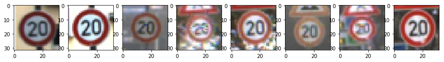
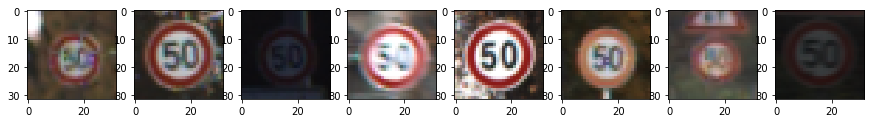
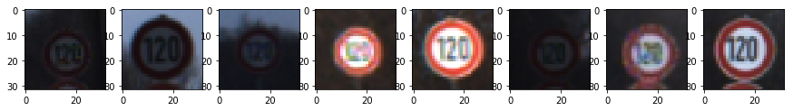
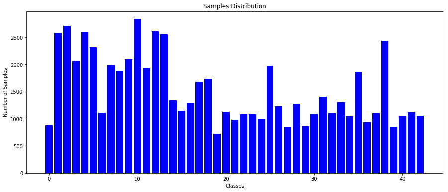
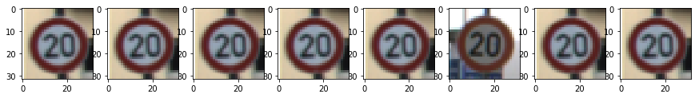
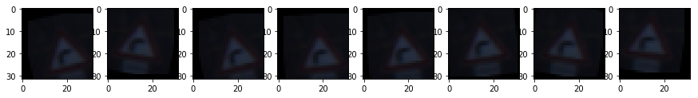
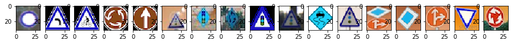
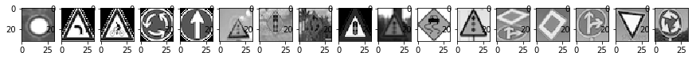
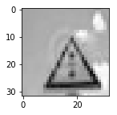
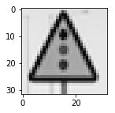

**Traffic Sign Recognition**
============================

 

**Build a Traffic Sign Recognition Project**

The goals / steps of this project are the following: \* Load the German Traffic
Signs pre-labelled dataset \* Explore, summarize and visualize the data set \*
Design, train and test a model architecture with high accuracy \* Use the model
to make predictions on new images from the internet \* Analyze the softmax
probabilities of the new images

 

### Data Set Summary & Exploration:

First we will explore together the dataset of traffic signs. We will see what is
a shape of an image, how many training, validation and testing examples are
available in the dataset.

As we will see, the dataset doesn't have a uniform distribution of the samples
for each class.

 

~~~~~~~~~~~~~~~~~~~~~~~~~~~~~~~~~~~~~~~~~~~~~~~~~~~~~~~~~~~~~~~~~~~~~~~~~ python
def get_data_summary(feature, label):
    import numpy as np
    # What's the shape of an traffic sign image?
    image_shape = feature[0].shape
    # How many unique classes/labels there are in the dataset.
    unique_classes, n_samples = np.unique(label,
                                          return_index=False,
                                          return_inverse=False,
                                          return_counts=True)
    n_classes = len(unique_classes)
    n_samples = n_samples.tolist()
    print("Image data shape =", image_shape)
    return image_shape[0], image_shape[2], n_classes, n_samples

def train_test_examples(x_train, x_validation, x_test):
    # Number of training examples
    n_train = len(x_train)
    # Number of validation examples
    n_validation = len(x_validation)
    # Number of testing examples.
    n_test = len(x_test)
    print("Number of training examples =", n_train)
    print("Number of validation examples =", n_validation)
    print("Number of testing examples =", n_test)
~~~~~~~~~~~~~~~~~~~~~~~~~~~~~~~~~~~~~~~~~~~~~~~~~~~~~~~~~~~~~~~~~~~~~~~~~~~~~~~~

-   Image shape = (32, 32, 3)

-   Number of training examples = 34799

-   Number of validation examples = 12630

-   Number of testing examples = 4410

-   Number of unique classes = 43

 

#### 2. Include an exploratory visualization of the dataset:

Now we will visualize the dataset, what are the features available and how the
labels are distributed in the dataset.

~~~~~~~~~~~~~~~~~~~~~~~~~~~~~~~~~~~~~~~~~~~~~~~~~~~~~~~~~~~~~~~~~~~~~~~~~ python
def get_classes_samples(index, labels):
    return [i for i, _x_ in enumerate(labels) if _x_ == index]

def loopover_data(index, x, y, high_range, steps):
    import matplotlib.pyplot as plt
    % matplotlib inline
    images = get_classes_samples(index, y)
    _images_ = images[:high_range:steps] if len(images) > 100 else images
    imgaes_in_row = int(high_range/steps)
    fig, axes = plt.subplots(1, imgaes_in_row, figsize=(15, 15))
    for _index, image_index in enumerate(_images_):
        image = x[image_index].squeeze()
        axes[_index].imshow(image)
    plt.show()

def visualize_data(x, y, n_classes, n_samples, high_range=160, steps=20, show_desc=True, single_class=False):
    from pandas.io.parsers import read_csv
    label_signs = read_csv('signnames.csv').values[:, 1]  # fetch only sign names
    if single_class:
        loopover_data(n_classes, x, y, high_range, steps)
    else:
        for index in range(n_classes):
            if show_desc:
                print("Class {} -- {} -- {} samples".format(index + 1, label_signs[index], n_samples[index]))
            loopover_data(index, x, y, high_range, steps)
~~~~~~~~~~~~~~~~~~~~~~~~~~~~~~~~~~~~~~~~~~~~~~~~~~~~~~~~~~~~~~~~~~~~~~~~~~~~~~~~

~~~~~~~~~~~~~~~~~~~~~~~~~~~~~~~~~~~~~~~~~~~~~~~~~~~~~~~~~~~~~~~~~~~~~~~~~~~~~~~~
Class 1 -- Speed limit (20km/h) -- 180 samples
~~~~~~~~~~~~~~~~~~~~~~~~~~~~~~~~~~~~~~~~~~~~~~~~~~~~~~~~~~~~~~~~~~~~~~~~~~~~~~~~

~~~~~~~~~~~~~~~~~~~~~~~~~~~~~~~~~~~~~~~~~~~~~~~~~~~~~~~~~~~~~~~~~~~~~~~~~~~~~~~~
Class 2 -- Speed limit (30km/h) -- 1980 samples
~~~~~~~~~~~~~~~~~~~~~~~~~~~~~~~~~~~~~~~~~~~~~~~~~~~~~~~~~~~~~~~~~~~~~~~~~~~~~~~~

~~~~~~~~~~~~~~~~~~~~~~~~~~~~~~~~~~~~~~~~~~~~~~~~~~~~~~~~~~~~~~~~~~~~~~~~~~~~~~~~
Class 3 -- Speed limit (50km/h) -- 2010 samples
~~~~~~~~~~~~~~~~~~~~~~~~~~~~~~~~~~~~~~~~~~~~~~~~~~~~~~~~~~~~~~~~~~~~~~~~~~~~~~~~

~~~~~~~~~~~~~~~~~~~~~~~~~~~~~~~~~~~~~~~~~~~~~~~~~~~~~~~~~~~~~~~~~~~~~~~~~~~~~~~~
Class 4 -- Speed limit (60km/h) -- 1260 samples
~~~~~~~~~~~~~~~~~~~~~~~~~~~~~~~~~~~~~~~~~~~~~~~~~~~~~~~~~~~~~~~~~~~~~~~~~~~~~~~~

~~~~~~~~~~~~~~~~~~~~~~~~~~~~~~~~~~~~~~~~~~~~~~~~~~~~~~~~~~~~~~~~~~~~~~~~~~~~~~~~
Class 5 -- Speed limit (70km/h) -- 1770 samples
~~~~~~~~~~~~~~~~~~~~~~~~~~~~~~~~~~~~~~~~~~~~~~~~~~~~~~~~~~~~~~~~~~~~~~~~~~~~~~~~

~~~~~~~~~~~~~~~~~~~~~~~~~~~~~~~~~~~~~~~~~~~~~~~~~~~~~~~~~~~~~~~~~~~~~~~~~~~~~~~~
Class 6 -- Speed limit (80km/h) -- 1650 samples
~~~~~~~~~~~~~~~~~~~~~~~~~~~~~~~~~~~~~~~~~~~~~~~~~~~~~~~~~~~~~~~~~~~~~~~~~~~~~~~~

~~~~~~~~~~~~~~~~~~~~~~~~~~~~~~~~~~~~~~~~~~~~~~~~~~~~~~~~~~~~~~~~~~~~~~~~~~~~~~~~
Class 7 -- End of speed limit (80km/h) -- 360 samples
~~~~~~~~~~~~~~~~~~~~~~~~~~~~~~~~~~~~~~~~~~~~~~~~~~~~~~~~~~~~~~~~~~~~~~~~~~~~~~~~

~~~~~~~~~~~~~~~~~~~~~~~~~~~~~~~~~~~~~~~~~~~~~~~~~~~~~~~~~~~~~~~~~~~~~~~~~~~~~~~~
Class 8 -- Speed limit (100km/h) -- 1290 samples
~~~~~~~~~~~~~~~~~~~~~~~~~~~~~~~~~~~~~~~~~~~~~~~~~~~~~~~~~~~~~~~~~~~~~~~~~~~~~~~~

~~~~~~~~~~~~~~~~~~~~~~~~~~~~~~~~~~~~~~~~~~~~~~~~~~~~~~~~~~~~~~~~~~~~~~~~~~~~~~~~
Class 9 -- Speed limit (120km/h) -- 1260 samples
~~~~~~~~~~~~~~~~~~~~~~~~~~~~~~~~~~~~~~~~~~~~~~~~~~~~~~~~~~~~~~~~~~~~~~~~~~~~~~~~

~~~~~~~~~~~~~~~~~~~~~~~~~~~~~~~~~~~~~~~~~~~~~~~~~~~~~~~~~~~~~~~~~~~~~~~~~~~~~~~~
Class 10 -- No passing -- 1320 samples
~~~~~~~~~~~~~~~~~~~~~~~~~~~~~~~~~~~~~~~~~~~~~~~~~~~~~~~~~~~~~~~~~~~~~~~~~~~~~~~~

~~~~~~~~~~~~~~~~~~~~~~~~~~~~~~~~~~~~~~~~~~~~~~~~~~~~~~~~~~~~~~~~~~~~~~~~~ python
def histogram_data(x, n_samples, n_classes):
    import matplotlib.pyplot as plt
    width = 1 / 1.2
    fig = plt.figure(figsize=(15, 6))
    ax = fig.add_subplot(111)
    ax.set_title('Samples Distribution')
    ax.set_xlabel('Classes')
    ax.set_ylabel('Number of Samples')
    plt.bar(range(n_classes), n_samples, width, color="blue")
    plt.show()
~~~~~~~~~~~~~~~~~~~~~~~~~~~~~~~~~~~~~~~~~~~~~~~~~~~~~~~~~~~~~~~~~~~~~~~~~~~~~~~~

#### Labels distribution in Train Dataset:

#### Labels distribution in Augmented Dataset:

As we discussed, the dataset contains very few samples for some the classes.
Obviously, we need to fix it.

We will see later how we can fix this issue by augmenting the given dataset but
for now let's enjoy the histogram after the data augmentation.

#### Labels distribution in Test Dataset:

### Pre-process the Data Set:

 

Preprocessing is an important step before training neural network. It consists
of:

Grayscale the images.

Normalize the dataset using Feature Scaling.

[Yann LeCun Paper](http://yann.lecun.com/exdb/publis/pdf/sermanet-ijcnn-11.pdf)
describes that the color channel info doesn't play any useful part in
classification, so we apply grayscaling on the images to have uniform values in
all 3 channels. The images are transformed to 3 channel grayscale using OpenCV.

 

The train, validation and test datasets are normalized using Feature Rescaling.
With normalization we have the pixel values ranging from 0 to 1 instead of 0 to
255.

 

~~~~~~~~~~~~~~~~~~~~~~~~~~~~~~~~~~~~~~~~~~~~~~~~~~~~~~~~~~~~~~~~~~~~~~~~~ python
def grayscale(x):
    import cv2 as cv
    import numpy as np
    for index, image in enumerate(x):
        gray = cv.cvtColor(image, cv.COLOR_RGB2GRAY)
        im2 = np.zeros_like(image)
        im2[:, :, 0], im2[:, :, 1], im2[:, :, 2] = gray, gray, gray
        x[index] = im2
    return x

def normalizer(x):
    import numpy as np
    x_min = float(np.min(x))
    x_max = float(np.max(x))
    x = (x - x_min) / (x_max - x_min)
    return x

def pre_process(features, labels, is_train=False):
    from sklearn.utils import shuffle
    assert (len(features) == len(labels))
    features = grayscale(features)
    features = normalizer(features)
    if is_train:
        features, labels = shuffle(features, labels)
    return features, labels
~~~~~~~~~~~~~~~~~~~~~~~~~~~~~~~~~~~~~~~~~~~~~~~~~~~~~~~~~~~~~~~~~~~~~~~~~~~~~~~~

 

### Image Transformations and Rotations:

 

As we saw earlier, the dataset doesn’t contain the uniform distribution of the
samples for each class. We can fix it by generating new images by performing
transformation using translation, rotation, changing brightness etc. This is
called Data Augmentation.

 

With augmentation, we gain another advantage that now our training set is larger
than before and also more varied so it also helps in reducing the overfit during
the training process.

 

I primarily used OpenCV for image transformations

 

~~~~~~~~~~~~~~~~~~~~~~~~~~~~~~~~~~~~~~~~~~~~~~~~~~~~~~~~~~~~~~~~~~~~~~~~~ python
def visualize_augmented_features(features, labels, index, images_in_row=1):
    import matplotlib.pyplot as plt
    from random import choice
    %matplotlib inline
    indices = get_classes_samples(index, labels)
    fig, axes = plt.subplots(1, images_in_row, figsize=(15, 15))
    for index in range(images_in_row):
        random_index = choice(indices)
        image = features[random_index].squeeze()
        axes[index].imshow(image)
    plt.show()
    
    
def perform_rotation(image, cols, rows):
    from random import randint
    import cv2
    center = (int(cols / 2), int(cols / 2))
    angle = randint(-12, 12)
    transformer = cv2.getRotationMatrix2D(center, angle, 1)
    image = cv2.warpAffine(image, transformer, (cols, rows))
    return image

def perform_translation(image, cols, rows, value):
    import cv2
    import numpy as np
    transformer = np.float32([[1, 0, value], [0, 1, value]])
    image = cv2.warpAffine(image, transformer, (cols, rows))
    return image

    
def perform_transformation(feature, label):
    from random import randint
    transform_level = 10
    rows, cols, channels = feature.shape
    rotational_value = randint(-int(rows / transform_level), int(rows / transform_level))
    image = perform_rotation(feature, cols, rows)
    image = perform_translation(image, cols, rows, rotational_value)
    return image, label

def augment_dataset(features, labels, n_classes):
    from random import randint
    from sklearn.utils import shuffle
    import numpy as np
    transforms_per_image = 20
    iterations = 100
    augmented_features, augmented_labels = [], []
    for _i_ in range(iterations):
        for i in range(transforms_per_image):
            # get a random class from 0 to 42
            random_class = randint(0, n_classes)
            # select 10 features and labels of that class
            selected_index = get_classes_samples(random_class, labels [random_class:random_class + 1]
            # print("index: ", selected_index)
            selected_labels = labels[selected_index]
            # perform transformation in each of the features
            for index, transform_y in zip(selected_index, selected_labels):
                # get rows and cols of the image
                transform_x = features[index]
                rows, cols, channels = transform_x.shape
                # create several transforms from a single image
                for value in range(-int(rows), int(rows), 4):
                    # perform transformations on the image
                    aug_x, aug_y = perform_transformation(transform_x, transform_y)
                    augmented_features.append(aug_x)
                    augmented_labels.append(aug_y)
    # append the results of transformations
    augmented_features, augmented_labels = shuffle(augmented_features, augmented_labels)
    augmented_features = np.array(augmented_features)
    # assertion
    assert (len(augmented_features) == len(augmented_labels))
    return augmented_features, augmented_labels
~~~~~~~~~~~~~~~~~~~~~~~~~~~~~~~~~~~~~~~~~~~~~~~~~~~~~~~~~~~~~~~~~~~~~~~~~~~~~~~~

#### Visualize how the transformation is performed.

 

### Design and Test a Model Architecture

 

The model consists of the following layers:

 

| Layer       | Description     | Filter Weight | Filter Bias | Stride | Padding | Dropout | Dimension           | Parameter |
|-------------|-----------------|---------------|-------------|--------|---------|---------|---------------------|-----------|
| **Layer 1** | Convolutional   | 5x5x6         | 6           | 2x2    | Valid   | 0.9     | Input 32x32x3       | 156       |
|             |                 |               |             |        |         |         | ReLU 28x28x6        |           |
|             |                 |               |             |        |         |         | Max Pooling 14x14x6 |           |
| **Layer 2** | Convolutional   | 5x5x16        | 16          | 2x2    | Valid   | 0.9     | Input 14x14x6       | 2416      |
|             |                 |               |             |        |         |         | ReLU 10x10x16       |           |
|             |                 |               |             |        |         |         | Max Pooling 5x5x16  |           |
| **Flatten** |                 |               |             |        |         |         | 400                 |           |
| **Layer 3** | Fully Connected | 400x120       | 120         |        |         | 0.6     | Input 400           | 48120     |
|             |                 |               |             |        |         |         | ReLU 120            |           |
| **Layer 4** | Fully Connected | 120x84        | 84          |        |         | 0.5     | Input 120           | 10164     |
|             |                 |               |             |        |         |         | ReLU 84             |           |
| **Layer 5** | Output          | 84x43         | 43          |        |         |         | Input 84            | 3655      |
|             |                 |               |             |        |         |         | Logits 84           |           |

 

~~~~~~~~~~~~~~~~~~~~~~~~~~~~~~~~~~~~~~~~~~~~~~~~~~~~~~~~~~~~~~~~~~~~~~~~~ python
hyper_params = {
    "mu": 0,
    "stddev": 0.1,
    "epoch": 25,
    "batch_size": 128,
    "rate": 0.001,
    "dropouts": [.9, .9, .6, .5],
    "test_dropouts": [1., 1., 1., 1.]
}
~~~~~~~~~~~~~~~~~~~~~~~~~~~~~~~~~~~~~~~~~~~~~~~~~~~~~~~~~~~~~~~~~~~~~~~~~~~~~~~~

 

Now we will train the classifier.

 

I used Adam Optimizer to optimize Weights and Biases using Back Propogation
instead of using Stochastic Gradient Descent.

 

Following is the implementation of the LeNet Architecture. For implementation
details of each layer, please have a look to the [Github
repo.](https://github.com/aurangzaib/CarND-Traffic-Sign-Classifier-Project)

 

~~~~~~~~~~~~~~~~~~~~~~~~~~~~~~~~~~~~~~~~~~~~~~~~~~~~~~~~~~~~~~~~~~~~~~~~~ python
def le_net(_x_, mu, stddev, dropouts, input_channels=1, output_channels=10):
    from tensorflow.contrib.layers import flatten
    train_dropouts = {
        'c1': dropouts[0],
        'c2': dropouts[1],
        'fc1': dropouts[2],
        'fc2': dropouts[3],
    }
    w, b = get_weights_biases(mu, stddev, input_channels, output_channels)
    padding = 'VALID'
    k = 2
    st, pool_st, pool_k = [1, 1, 1, 1], [1, k, k, 1], [1, k, k, 1]
    # Layer 1 -- convolution layer:
    conv1 = convolution_layer(_x_, w['c1'], b['c1'], st, padding, pool_k, pool_st, train_dropouts['c1'])
    # Layer 2 -- convolution layer:
    conv2 = convolution_layer(conv1, w['c2'], b['c2'], st, padding, pool_k, pool_st, train_dropouts['c2'])
    # Flatten
    fc1 = flatten(conv2)
    print("Faltten: {}".format(fc1.get_shape()))
    # Layer 3 -- fully connected layer:
    fc1 = full_connected_layer(fc1, w['fc1'], b['fc1'], train_dropouts['fc1'])
    # Layer 4 -- full connected layer:
    fc2 = full_connected_layer(fc1, w['fc2'], b['fc2'], train_dropouts['fc2'])
    # Layer 5 -- fully connected output layer:
    out = output_layer(fc2, w['out'], b['out'])
    # parameters in each layer
    n_parameters(conv1, conv2, fc1, fc2, out)
    return out
~~~~~~~~~~~~~~~~~~~~~~~~~~~~~~~~~~~~~~~~~~~~~~~~~~~~~~~~~~~~~~~~~~~~~~~~~~~~~~~~

 

When training a network on not-so-powerful computers, it is important to apply
Mini-batching so that the network can be trained with small chunks of the
training data at a time without overloading the memory of the machine. I wrote
following code for mini-batching:

 

~~~~~~~~~~~~~~~~~~~~~~~~~~~~~~~~~~~~~~~~~~~~~~~~~~~~~~~~~~~~~~~~~~~~~~~~~ python
def get_batches(_batch_size_, _features_, _labels_):
    import math
    total_size, index, batch = len(_features_), 0, []
    n_batches = int(math.ceil(total_size / _batch_size_)) if _batch_size_ > 0 else 0
    for _i_ in range(n_batches - 1):
        batch.append([_features_[index:index + _batch_size_],
                      _labels_[index:index + _batch_size_]])
        index += _batch_size_
    batch.append([_features_[index:], _labels_[index:]])
    return batch
~~~~~~~~~~~~~~~~~~~~~~~~~~~~~~~~~~~~~~~~~~~~~~~~~~~~~~~~~~~~~~~~~~~~~~~~~~~~~~~~

 

Now, for actual training of the network, we need to create a session of
TensorFlow:

 

~~~~~~~~~~~~~~~~~~~~~~~~~~~~~~~~~~~~~~~~~~~~~~~~~~~~~~~~~~~~~~~~~~~~~~~~~ python
retrain_model = True
if retrain_model:
    with tf.Session() as sess:
        sess.run(init)
        print("Training....")
        for e in range(hyper_params['epoch']):
            # training the network
            x_train_p, y_train_p = shuffle(x_train_p, y_train_p)
            batches = get_batches(hyper_params['batch_size'], x_train_p, y_train_p)
            for batch_x, batch_y in batches:
                batch_x, batch_y = shuffle(batch_x, batch_y)
                sess.run(optimizer, feed_dict={
                    x: batch_x, y: batch_y,
                    dropouts: hyper_params['dropouts']
                })
            # validation the network
            validation_accuracy = sess.run(accuracy, feed_dict={
                x: x_validation_p, y: y_validation_p,
                dropouts: hyper_params['test_dropouts']
            })
            print("{}th epoch - before: {:2.3f}%".format(e + 1, validation_accuracy * 100))
        saver.save(sess, save_file)
    print("Model saved")
~~~~~~~~~~~~~~~~~~~~~~~~~~~~~~~~~~~~~~~~~~~~~~~~~~~~~~~~~~~~~~~~~~~~~~~~~~~~~~~~

 

My results for the Validation sets are:

 

| Epochs | Accuracy (%) | Epochs | Accuracy (%) |
|--------|--------------|--------|--------------|
| 1st    | 65.376       | 2nd    | 79.557       |
| 3rd    | 83.903       | 4th    | 86.469       |
| 5th    | 88.599       | 6th    | 89.438       |
| 7th    | 89.739       | 8th    | 90.530       |
| 9th    | 90.665       | 10th   | 91.354       |
| 11th   | 91.291       | 12th   | 91.876       |
| 13th   | 92.336       | 14th   | 92.185       |
| 15th   | 92.272       | 16th   | 92.637       |
| 17th   | 92.605       | 18th   | 92.866       |
| 19th   | 91.568       | 20     | 93.009       |
| 21st   | 93.389       | 22nd   | 93.199       |
| 23rd   | 93.436       | 24th   | 93.515       |
| 25th   | 93.793       |        |              |

 

Now comes the part where we test the accuracy of the network on the hidden test
data.

 

~~~~~~~~~~~~~~~~~~~~~~~~~~~~~~~~~~~~~~~~~~~~~~~~~~~~~~~~~~~~~~~~~~~~~~~~~ python
test_data = True
if test_data:
    with tf.Session() as sess:
        saver.restore(sess, save_file)
        print("Model restored")
        test_accuracy = sess.run(accuracy, feed_dict={
            x: x_test_p,
            y: y_test_p,
            dropouts: hyper_params['test_dropouts']
        })
        print("test accuracy: {:2.3f}%".format(test_accuracy * 100))
~~~~~~~~~~~~~~~~~~~~~~~~~~~~~~~~~~~~~~~~~~~~~~~~~~~~~~~~~~~~~~~~~~~~~~~~~~~~~~~~

 

The network is able to achieve 95.306% accuracy on the test data:

| Test Accuracy | 95.306% |
|---------------|---------|

 

### Test a Model on New Images

 

To give myself more insight into how your model is working, I downloaded several
images from the internet of traffic signs and tested the accuracy of the
pre-trained network.

~~~~~~~~~~~~~~~~~~~~~~~~~~~~~~~~~~~~~~~~~~~~~~~~~~~~~~~~~~~~~~~~~~~~~~~~~ python
x_test_new_p, y_test_new_p = pre_process(x_test_new, y_test_new)
visualize_test_images(x_test_new)
~~~~~~~~~~~~~~~~~~~~~~~~~~~~~~~~~~~~~~~~~~~~~~~~~~~~~~~~~~~~~~~~~~~~~~~~~~~~~~~~

 

~   png

~~~~~~~~~~~~~~~~~~~~~~~~~~~~~~~~~~~~~~~~~~~~~~~~~~~~~~~~~~~~~~~~~~~~~~~~~~~~~~~~
Ground Truth:
No Vehicle
 
Network Predictions:
No vehicles:  100.000%
Speed limit (70km/h):  0.000%
Speed limit (50km/h):  0.000%
Speed limit (120km/h):  0.000%
Speed limit (80km/h):  0.000%
~~~~~~~~~~~~~~~~~~~~~~~~~~~~~~~~~~~~~~~~~~~~~~~~~~~~~~~~~~~~~~~~~~~~~~~~~~~~~~~~

~~~~~~~~~~~~~~~~~~~~~~~~~~~~~~~~~~~~~~~~~~~~~~~~~~~~~~~~~~~~~~~~~~~~~~~~~~~~~~~~
Ground Truth:
Dangerous curve left

Network Predictions:
Dangerous curve to the left:  100.000%
Slippery road:  0.000%
Right-of-way at the next intersection:  0.000%
Double curve:  0.000%
Road work:  0.000%
~~~~~~~~~~~~~~~~~~~~~~~~~~~~~~~~~~~~~~~~~~~~~~~~~~~~~~~~~~~~~~~~~~~~~~~~~~~~~~~~

~~~~~~~~~~~~~~~~~~~~~~~~~~~~~~~~~~~~~~~~~~~~~~~~~~~~~~~~~~~~~~~~~~~~~~~~~~~~~~~~
Ground Truth:
Bicycle crossing

Network Predictions:
Road narrows on the right:  42.401%
Pedestrians:  37.532%
General caution:  19.522%
Traffic signals:  0.370%
Right-of-way at the next intersection:  0.150%
~~~~~~~~~~~~~~~~~~~~~~~~~~~~~~~~~~~~~~~~~~~~~~~~~~~~~~~~~~~~~~~~~~~~~~~~~~~~~~~~

~~~~~~~~~~~~~~~~~~~~~~~~~~~~~~~~~~~~~~~~~~~~~~~~~~~~~~~~~~~~~~~~~~~~~~~~~~~~~~~~
Ground Truth:
Roundabout mandatory

Network Predictions:
Roundabout mandatory:  84.611%
Priority road:  8.660%
End of no passing by vehicles over 3.5 metric tons:  3.120%
Right-of-way at the next intersection:  2.012%
Speed limit (100km/h):  0.713%
~~~~~~~~~~~~~~~~~~~~~~~~~~~~~~~~~~~~~~~~~~~~~~~~~~~~~~~~~~~~~~~~~~~~~~~~~~~~~~~~

~~~~~~~~~~~~~~~~~~~~~~~~~~~~~~~~~~~~~~~~~~~~~~~~~~~~~~~~~~~~~~~~~~~~~~~~~~~~~~~~
Ground Truth:
Ahead Only

Network Predictions:
Ahead only:  100.000%
No passing:  0.000%
Bicycles crossing:  0.000%
Turn left ahead:  0.000%
Speed limit (60km/h):  0.000%
~~~~~~~~~~~~~~~~~~~~~~~~~~~~~~~~~~~~~~~~~~~~~~~~~~~~~~~~~~~~~~~~~~~~~~~~~~~~~~~~

~~~~~~~~~~~~~~~~~~~~~~~~~~~~~~~~~~~~~~~~~~~~~~~~~~~~~~~~~~~~~~~~~~~~~~~~~~~~~~~~
Ground Truth:
Traffic Signals

Network Predictions:
Road narrows on the right:  98.333%
Pedestrians:  0.889%
Road work:  0.563%
Children crossing:  0.071%
General caution:  0.052%
~~~~~~~~~~~~~~~~~~~~~~~~~~~~~~~~~~~~~~~~~~~~~~~~~~~~~~~~~~~~~~~~~~~~~~~~~~~~~~~~

~~~~~~~~~~~~~~~~~~~~~~~~~~~~~~~~~~~~~~~~~~~~~~~~~~~~~~~~~~~~~~~~~~~~~~~~~~~~~~~~
Ground Truth:
Traffic Signals

Network Predictions:
Beware of ice/snow:  56.233%
Right-of-way at the next intersection:  27.989%
Double curve:  7.642%
Traffic signals:  2.601%
Children crossing:  1.434%
~~~~~~~~~~~~~~~~~~~~~~~~~~~~~~~~~~~~~~~~~~~~~~~~~~~~~~~~~~~~~~~~~~~~~~~~~~~~~~~~

~~~~~~~~~~~~~~~~~~~~~~~~~~~~~~~~~~~~~~~~~~~~~~~~~~~~~~~~~~~~~~~~~~~~~~~~~~~~~~~~
Ground Truth:
Roundabout mandatory

Network Predictions:
Yield:  71.145%
No vehicles:  9.539%
Stop:  6.892%
Priority road:  3.922%
Road work:  1.760%
~~~~~~~~~~~~~~~~~~~~~~~~~~~~~~~~~~~~~~~~~~~~~~~~~~~~~~~~~~~~~~~~~~~~~~~~~~~~~~~~

~~~~~~~~~~~~~~~~~~~~~~~~~~~~~~~~~~~~~~~~~~~~~~~~~~~~~~~~~~~~~~~~~~~~~~~~~~~~~~~~
Ground Truth:
Traffic signals

Network Predictions:
General caution:  54.849%
Traffic signals:  45.148%
Pedestrians:  0.003%
Right-of-way at the next intersection:  0.000%
Road narrows on the right:  0.000%
~~~~~~~~~~~~~~~~~~~~~~~~~~~~~~~~~~~~~~~~~~~~~~~~~~~~~~~~~~~~~~~~~~~~~~~~~~~~~~~~

~~~~~~~~~~~~~~~~~~~~~~~~~~~~~~~~~~~~~~~~~~~~~~~~~~~~~~~~~~~~~~~~~~~~~~~~~~~~~~~~
Ground Truth:
Traffic signals

Network Predictions:
Traffic signals:  95.580%
General caution:  4.420%
Road narrows on the right:  0.000%
Pedestrians:  0.000%
Road work:  0.000%
~~~~~~~~~~~~~~~~~~~~~~~~~~~~~~~~~~~~~~~~~~~~~~~~~~~~~~~~~~~~~~~~~~~~~~~~~~~~~~~~

~~~~~~~~~~~~~~~~~~~~~~~~~~~~~~~~~~~~~~~~~~~~~~~~~~~~~~~~~~~~~~~~~~~~~~~~~~~~~~~~
Ground Truth:
Slippery road

Network Predictions:
No entry:  99.996%
Stop:  0.004%
Turn right ahead:  0.000%
Roundabout mandatory:  0.000%
Speed limit (70km/h):  0.000%
~~~~~~~~~~~~~~~~~~~~~~~~~~~~~~~~~~~~~~~~~~~~~~~~~~~~~~~~~~~~~~~~~~~~~~~~~~~~~~~~

~~~~~~~~~~~~~~~~~~~~~~~~~~~~~~~~~~~~~~~~~~~~~~~~~~~~~~~~~~~~~~~~~~~~~~~~~~~~~~~~
Ground Truth:
Traffic signals

Network Predictions:
General caution:  99.994%
Traffic signals:  0.006%
Pedestrians:  0.000%
Bumpy road:  0.000%
Road narrows on the right:  0.000%
~~~~~~~~~~~~~~~~~~~~~~~~~~~~~~~~~~~~~~~~~~~~~~~~~~~~~~~~~~~~~~~~~~~~~~~~~~~~~~~~

~~~~~~~~~~~~~~~~~~~~~~~~~~~~~~~~~~~~~~~~~~~~~~~~~~~~~~~~~~~~~~~~~~~~~~~~~~~~~~~~
Ground Truth:
Two Symbols

Network Predictions:
No passing:  78.461%
Keep left:  9.933%
Yield:  8.010%
No passing for vehicles over 3.5 metric tons:  0.935%
Speed limit (60km/h):  0.751%
~~~~~~~~~~~~~~~~~~~~~~~~~~~~~~~~~~~~~~~~~~~~~~~~~~~~~~~~~~~~~~~~~~~~~~~~~~~~~~~~

~~~~~~~~~~~~~~~~~~~~~~~~~~~~~~~~~~~~~~~~~~~~~~~~~~~~~~~~~~~~~~~~~~~~~~~~~~~~~~~~
Ground Truth:
Priority road

Network Predictions:
Priority road:  100.000%
Roundabout mandatory:  0.000%
Right-of-way at the next intersection:  0.000%
Yield:  0.000%
No passing:  0.000%
~~~~~~~~~~~~~~~~~~~~~~~~~~~~~~~~~~~~~~~~~~~~~~~~~~~~~~~~~~~~~~~~~~~~~~~~~~~~~~~~

~~~~~~~~~~~~~~~~~~~~~~~~~~~~~~~~~~~~~~~~~~~~~~~~~~~~~~~~~~~~~~~~~~~~~~~~~~~~~~~~
Ground Truth:
Go straight or right

Network Predictions:
Turn right ahead:  99.983%
Stop:  0.017%
Keep left:  0.000%
Speed limit (30km/h):  0.000%
No entry:  0.000%
~~~~~~~~~~~~~~~~~~~~~~~~~~~~~~~~~~~~~~~~~~~~~~~~~~~~~~~~~~~~~~~~~~~~~~~~~~~~~~~~

~~~~~~~~~~~~~~~~~~~~~~~~~~~~~~~~~~~~~~~~~~~~~~~~~~~~~~~~~~~~~~~~~~~~~~~~~~~~~~~~
Ground Truth:
Yield

Network Predictions:
Yield:  100.000%
Speed limit (20km/h):  0.000%
Speed limit (30km/h):  0.000%
Speed limit (50km/h):  0.000%
Speed limit (60km/h):  0.000%
~~~~~~~~~~~~~~~~~~~~~~~~~~~~~~~~~~~~~~~~~~~~~~~~~~~~~~~~~~~~~~~~~~~~~~~~~~~~~~~~

~~~~~~~~~~~~~~~~~~~~~~~~~~~~~~~~~~~~~~~~~~~~~~~~~~~~~~~~~~~~~~~~~~~~~~~~~~~~~~~~
Ground Truth:
Roundabout mandatory

Network Predictions:
Roundabout mandatory:  42.161%
End of no passing by vehicles over 3.5 metric tons:  38.446%
Priority road:  13.663%
Right-of-way at the next intersection:  2.242%
Keep right:  1.334%
~~~~~~~~~~~~~~~~~~~~~~~~~~~~~~~~~~~~~~~~~~~~~~~~~~~~~~~~~~~~~~~~~~~~~~~~~~~~~~~~

The first image might be difficult to classify because ...

#### 2. Discuss the model's predictions on these new traffic signs and compare the results to predicting on the test set. At a minimum, discuss what the predictions were, the accuracy on these new predictions, and compare the accuracy to the accuracy on the test set (OPTIONAL: Discuss the results in more detail as described in the "Stand Out Suggestions" part of the rubric).

Here are the results of the prediction:

| Image         | Prediction    |
|---------------|---------------|
| Stop Sign     | Stop sign     |
| U-turn        | U-turn        |
| Yield         | Yield         |
| 100 km/h      | Bumpy Road    |
| Slippery Road | Slippery Road |

The model was able to correctly guess 4 of the 5 traffic signs, which gives an
accuracy of 80%. This compares favorably to the accuracy on the test set of ...

#### 3. Describe how certain the model is when predicting on each of the five new images by looking at the softmax probabilities for each prediction. Provide the top 5 softmax probabilities for each image along with the sign type of each probability. (OPTIONAL: as described in the "Stand Out Suggestions" part of the rubric, visualizations can also be provided such as bar charts)

The code for making predictions on my final model is located in the 11th cell of
the Ipython notebook.

For the first image, the model is relatively sure that this is a stop sign
(probability of 0.6), and the image does contain a stop sign. The top five soft
max probabilities were

| Probability | Prediction    |
|-------------|---------------|
| .60         | Stop sign     |
| .20         | U-turn        |
| .05         | Yield         |
| .04         | Bumpy Road    |
| .01         | Slippery Road |

For the second image ...

### (Optional) Visualizing the Neural Network (See Step 4 of the Ipython notebook for more details)

#### 1. Discuss the visual output of your trained network's feature maps. What characteristics did the neural network use to make classifications?

If you looking for the implementation of the project:

https://github.com/aurangzaib/CarND-Traffic-Sign-Classifier-Project
